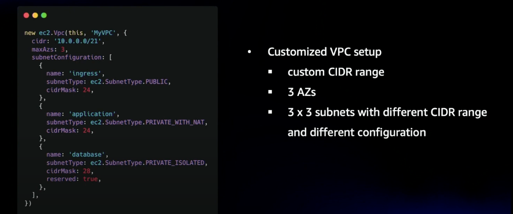

# Patterns for Infrastructure


## Resource Contains
The application contains patterns/blocks to build infrastructure. Patterns should have a semantic not a technical 
meaning like a SubscriptionAPIGateway.

Patterns are:
- CDK-Lvl2 constructs abstracting AWS-Resources in one service like apigateway, CfnOutputs and imports, cloudwatch...
- CDK-Lvl3 constructs abstracting AWS-Resources in more than one service.
- NestedStacks can combine constructs if CDK-Lvl3 constructs is not possible if f.e. resource limits are reached

### Some words about files 
- a pattern-file consists of 1 file named like the pattern. it consists of:
  - pattern-class (f.e. construct, stack...)
  - properties
  - enums
  - role
  - interface
  - private patterns. Private patterns are just useful for one pattern.
- it doesnt consists of:
  - tests. Tests are declared in /test/<pattern-class>/<pattern>.test.ts

### Clean Code
- we dont want to use comments. Use private methods, if possible
- pattern-class should have js-doc explaining its semantic and its usage.


## Method of building infrastructure:

### Definitions
- Any domain and any stage has its account.
- There can be multiple applications in a domain.
- The applications are owned by the team.
- The use of serverless or cdk is the choice of the team.
- The infrastructure is owned by the devOps right now.
- It provides resources by stacks which are requirements, useful helpers or fulfillment's of standards.
- The communication between stacks (inc serverless) is done with exported output variables. Its called **Context**

### Stacks at infrastructure
The stacks of the infrastructure will be build by Owner and Lifecycle. 
A lifecycle defines the dependency like an application or the specifications.
Patterns should be used inside the these stacks to build it.

#### Examples
- ApplicationAccountsDevOpsStack: Lifecycle Application "_Accounts_" Owner: "_DevOps_"
- SpecificationAccountsDevOpsStack: Lifecycle Specifications for "_Accounts_" Owner: "_DevOps_"
- DomainAppStack: Lifecycle Domain Owner: "_App-Team_"


## RoleModels

### Links
- [AWS Solution Patterns](https://aws.amazon.com/de/solutions/constructs/patterns/)
- [CDK Patterns with example](https://cdkpatterns.com/patterns/filter/?by=API%20Gateway%20HTTP%20API)


## Context: Share AWS Resources between Stacks

We use **CfnOutputVars** to share AWS Resources between stacks. CfnOutputVars import and export strings, which can represent identifier.
- The context is created by the infrastructure not the patterns! Otherwise we couple app and patterns indirectly.
- defaults can be set in the constructs not more.


## Standards for Roles and Policies

### Design Considerations

- Inheritance can be avoided if possible and use ‘Contains’(Aggregation) approach. Using contains approach the object can be made read-only and can prevent accidental changes to the behaviour of the construct in the Application stack
- All constructs can expose the objects as public variables or private variables with getter functions
- Construct patterns must inherit the base XprIamRole and XprIamPolicy constructs to create the custom roles
  For eg. refer to SubscriptionApiGatewayRole or PublicEventBridgeRole
- For every resource construct a default role and policy can be defined with a least privilege approach.
- Grant functions provided by CDK can be used to simplify the policy assignments. For eg. DynamoDB table, we can use DynamoDB.grantReadData(Iprincipal)
- Access permissions must be optional initially when the resource is created. Every construct must expose additional methods to update properties and access permissions

### Base Constucts

XprIamRole is the base construct for creating a new Iam Role.

This construct creates a role with the given roleName, principals and attaches the default set of policies
passed by the custom role construct. All principals are added together to create a CompositePrincipal.
This allows different set of principals to be assumed in a single role.

```
export class XprIamRole extends Construct {
    public readonly role: iam.IRole; 

    constructor(scope: Construct, id: string, props: XprRoleProps) {
        super(scope, id);
        
        // Create role and attach the above policy
          const role = new iam.Role(this, id, {
              roleName: props.roleName,
              assumedBy: this.createCompositePrincipal(props.principals),
              description: 'IAM role for :' + props.description,
          });
          if (props.policy) {
              role.attachInlinePolicy(props.policy);
          }
          this.role = role;
    }

    ...
}
```

### Custom Role Constucts

PublicEventBridgeRole is a custom role construct for creating a new Iam Role for Public Event Bridge.

This construct creates a role for the PublicEventBridge to allow PublicPublisherEventBus to put events to CentralEventBus. Service principal 'events.amazonaws.com' is given the permission using the 'grantPutEventsTo' function.

```
class PublicEventBridgeRole extends XprIamRole {

    constructor(scope: Construct, id: string) {
        // Create a role and set the policy
        const roleProps: XprRoleProps = {
            roleName: PublicEventBridgeRoleEnum.ROLE,
            description: PublicEventBridgeRoleEnum.DESCRIPTION,
            principals: {
                servicePrincipals: [ "events.amazonaws.com"]
            }
        }
        super(scope, PublicEventBridgeRoleEnum.CONSTRUCT_ID, roleProps)
        new CfnOutput(scope, PublicEventBridgeRoleEnum.CFN_OUTPUT_ARN, {value: this.role.roleArn});
    }
}
```

Grant permission to the service principal

```
    public grantPutEventsTo(role: IRole) {
        this._publicPublisherEventBus.grantPutEventsTo(role)
    }
```

### Base Policy Construct

XprIamPolicy construct creates a Policy resource with PolicyStatements based on the policy properties
like resources, actions and effect passed by the client.

This can be used alternatively to the 'Grant' functions in some cases.

```
export class XprIamPolicy extends Construct {
    public readonly policy: iam.Policy; 

    constructor(scope: Construct, id: string, props: XprPolicyProps) {
        super(scope, id);

        // Create a Policy Document to setup access permissions to dynamodb table
        const policy = new iam.Policy(this, id, {
            statements: [
                new iam.PolicyStatement({
                    resources: props.resources,
                    actions: props.actions,
                    effect: props.effect,
                }),
            ],
        });

        this.policy = policy;
    }
}
```

### Using Grant functions for permissions

Most of the CDK resource constructs provide 'grantXX()' functions to provision the policies for the Grantee which is typically a IRole. 

'grantXX()' functions can be implemented as part of the custom resource constructs to simplify the attachment of polices to the role.

As an alternative, any resource that wants to provide additional permissions to a principal can expose 'grant(XprPolicyProps)' functions to allow
the application stacks to add specific permissions as needed. This method uses the XprIamPolicy construct to setup the policies.

For eg. in case of SubscriptionApiGateway, the construct implements the following grant functions to attach api invocation permission.

```
export class SubscriptionApiGateway extends Construct {

  private _api: RestApi;
  private _role: IRole;

  constructor(scope: Construct, id: string) {
    ...
    
    this._role = new SubscriptionApiGatewayRole(scope, SubscriptionApiGatewayRoleEnum.CONSTRUCT_ID).role
    this.grantInvoke(this._role);
    
    ...
  }

  public grant(policyProps: XprPolicyProps) {
    const subscriptionApiGatewayInvokePolicy = new XprIamPolicy(this, SubscriptionApiGatewayRoleEnum.POLICY_ID, policyProps).policy;
    this._role.attachInlinePolicy(subscriptionApiGatewayInvokePolicy)
  }

  public grantInvoke(role: IRole) {
    const policyProps: XprPolicyProps = {
      resources: ["*"],
      actions: ['execute-api:Invoke', 'execute-api:ManageConnections'],
      effect: iam.Effect.ALLOW,
    }
    const subscriptionApiGatewayInvokePolicy = new XprIamPolicy(this, SubscriptionApiGatewayRoleEnum.POLICY_ID, policyProps).policy;
    role.attachInlinePolicy(subscriptionApiGatewayInvokePolicy)
  }
}
```

### Custom resource constructs should expose roles

For eg. SubscriptionApiGateway exposes the default iam role created when the API resources is constructed.

```
export class SubscriptionApiGateway extends Construct {

  private _api: RestApi;
  private _role: IRole;

  constructor(scope: Construct, id: string) {
    ...
    
    this._role = new SubscriptionApiGatewayRole(scope, SubscriptionApiGatewayRoleEnum.CONSTRUCT_ID).role
    this.grantInvoke(this._role);
    
    ...
  }

  public static getRoleFromName(scope: Construct): IRole {
    let role = SubscriptionApiGatewayRole.fromRoleName(scope);
    if (role ==  null) {
      role = new SubscriptionApiGatewayRole(scope, SubscriptionApiGatewayRoleEnum.CONSTRUCT_ID).role
    }
    return role
  }

  public static getRoleFromArn(scope: Construct): IRole {
    let role = SubscriptionApiGatewayRole.fromRoleArn(scope);
    if (role ==  null) {
      role = new SubscriptionApiGatewayRole(scope, SubscriptionApiGatewayRoleEnum.CONSTRUCT_ID).role
    }
    return role
  }

  public getRole(): IRole {
    return this._role;
  }

  ...
}
```


## Basic Information about CDK-Pattern

### Getting Started
- CDK is infrastructure as code.
- to work with cdk, you have a cli
- deployment: synths to Cloudformation, calculates change-set and deploys. This means you cannot get the current state 
of the resources in the AWS-Account.


#### the model


#### 1*App
The App in CDK represents the entry point for the entire CDK application.
- A CDK process can only synth/deploy one app at a time.
- They cannot be defined in the same file.
- They cannot directly reference each other's resources.

#### n*Stack = Cfn Stacks
A stack can be deployed, is related to a CfnStack.
All resources are defined in the stack.

this results in 8k Cfn code

#### n*Constructs
Constructs are Abstractions of AWS resources
- **AWS CloudFormation-only or L1**
  1:1 relation to Cfn-resources
  They are prefixed by Cfn
  => Cfn can be translated to CDK-Constructs L1

- **Curated or L2**
  Abstraction of n*resources curated by AWS in one Service. providing defaults, glue-logic, simplifications (grants)
  Defaults for parameter make L2 easier to use as L1
  f.e. S3Bucket, DynamoDbTable, Vpc


- **Patterns or L3**
  semantic Abstraction for concrete use-cases for n*resources in m*Services
  Patterns are hosted by AWS or Third-party or by us for our use-cases. So build your own lib by your customized building blocks
  - They can handle specific, new use-cases
  - standardize standard-resources (L2)
  - simplify infrastructure creation
  - declaring the building blocks of our software


### Links
- [german video](https://www.youtube.com/watch?v=POyBEaJnqJ8&t=998s)
